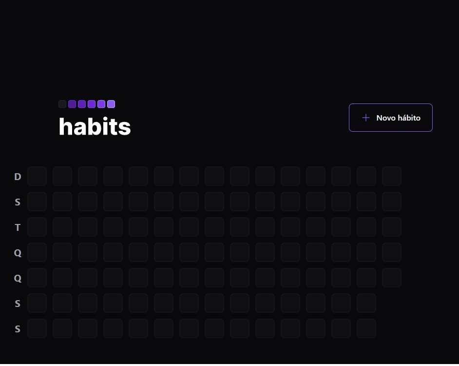
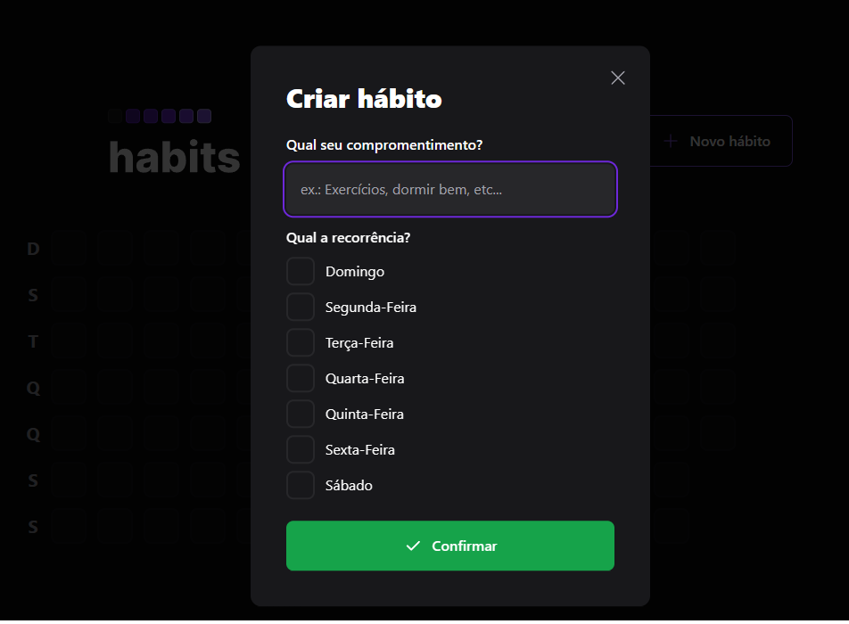
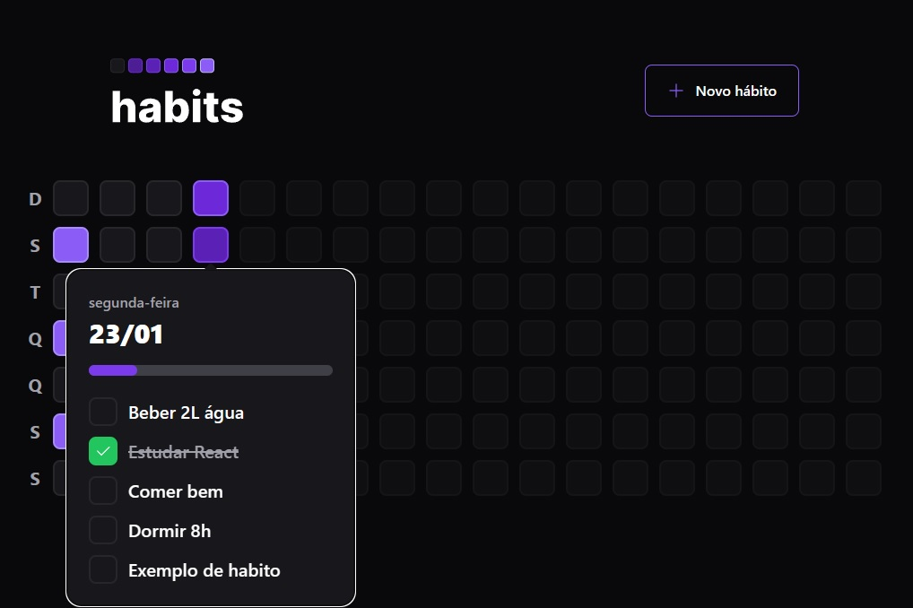

<h1 align="center">
    
</h1>

    
    
    

# NLW Setup

Bootcamp performed by Rocketseat to take the next level in React development

The main idea is to build an app where you can register and monitor your habits in a very practical and intuitive way

### 🛠 Tecnologias

The following technologies were use:

- [React](https://pt-br.reactjs.org/)
- [NextJs](https://nextjs.org/)
- [Radix UI](https://www.radix-ui.com/)
- [Vite JS](https://vitejs.dev/)
- [Tailwind CSS](https://tailwindcss.com/)
- [Post CSS](https://postcss.org/)
- [Phosphor icons](https://storybook.js.org/)
- [TypeScript](https://www.typescriptlang.org/)
- [Axios](https://axios-http.com/ptbr/docs/intro)